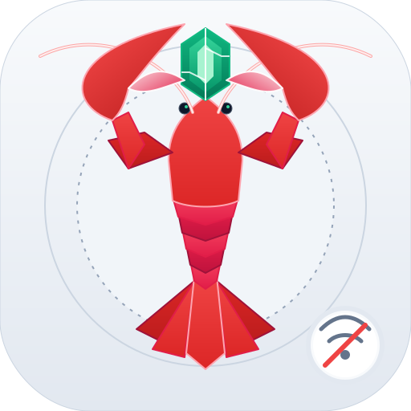

<p align="center">
  
</p>

<p align="center">
  
</p>

<p align="center">
  <strong>Config-driven offline plugin and skill seeding for OpenClaw runtimes.</strong>
</p>

[](https://github.com/weak-fox/openclaw-offline-seed/actions/workflows/ci.yml)
[](https://github.com/weak-fox/openclaw-offline-seed/releases)
[](https://github.com/weak-fox/openclaw-offline-seed/blob/main/LICENSE)

---

> **`openclaw-offline-seed`** is a companion image project for OpenClaw offline deployments.
> 
> It builds a seed image that contains pre-installed plugins and skills, then copies them into the OpenClaw runtime home directory (`OPENCLAW_HOME_DIR`, default: `/home/node/.openclaw`) before OpenClaw starts.

This project is not tied to one chart. You can integrate it with:

- ☸️ Any Kubernetes Deployment/StatefulSet
- ⛵ Any Helm chart
- 🐳 Docker run / Docker Compose

## 📦 What gets seeded

- `extensions/*` (plugins)
- `workspace/skills/*` (skills)

## 🏠 Runtime home path

`seed-init.sh` writes into `OPENCLAW_HOME_DIR`.

- If `OPENCLAW_HOME_DIR` is not set, it defaults to `/home/node/.openclaw`.
- You can set it to any path, as long as seed and runtime use the same mounted directory.
- Keep these three values aligned:
  1. `OPENCLAW_HOME_DIR` in the seed container
  2. Seed container volume mount path
  3. OpenClaw runtime volume mount/home path

## ⚙️ Configure install list

Edit [`config/seed-config.json`](./config/seed-config.json):

```json
{
  "plugins": [
    { "spec": "openclaw-mcp-adapter", "enabled": true }
  ],
  "skills": [
    { "slug": "weather", "enabled": true }
  ]
}
```

**Supported item formats:**

- **`plugins`**: `"<spec>"` or `{ "spec": "<spec>", "enabled": true }`
- **`skills`**: `"<slug>"` or `{ "slug": "<slug>", "enabled": true }`

> 💡 `spec` is passed directly to `openclaw plugins install`, so you can use npm specs, local paths, or tarballs.

Schema reference: [`config/seed-config.schema.json`](./config/seed-config.schema.json)

## 📁 Optional vendoring for strict offline builds

If you do not want build-time network installs, vendor local content:

- `plugins/<plugin-id>/...`
- `skills/<skill-name>/...`

Those directories are copied directly into the seed payload.

## 🏗️ Build and push

```bash
cd openclaw-offline-seed

IMAGE=REGISTRY/openclaw-offline-seed:v1 \
OPENCLAW_IMAGE=REGISTRY/openclaw:2026.3.1 \
CONFIG_PATH=config/seed-config.json \
./build.sh

docker push REGISTRY/openclaw-offline-seed:v1
```

## ⛵ Integration: Helm charts (generic)

If your chart supports overriding init containers, inject one seed init container that:

- Uses image `REGISTRY/openclaw-offline-seed:v1`
- Runs `/usr/local/bin/seed-init.sh`
- Mounts the same persistent data volume as the OpenClaw runtime at `OPENCLAW_HOME_DIR`

> ⚠️ The concrete values path differs across charts, so this project does not assume a specific chart structure.
> Use the Kubernetes snippet below as the source of truth.

## ☸️ Integration: generic Kubernetes

Use an init container that mounts the same OpenClaw data volume and runs `/usr/local/bin/seed-init.sh`.

📝 Example manifest snippet: [`examples/kubernetes-init-container.yaml`](./examples/kubernetes-init-container.yaml)

**Key points:**

- Mount the same PVC to both the seed init container and OpenClaw container
- Set `OPENCLAW_HOME_DIR` to the runtime home path you use
- Set OpenClaw plugin loading to preinstalled mode in your runtime config

> ⚠️ If you use `--bind lan` for quick verification in Kubernetes, you may use the same
> `dangerouslyAllowHostHeaderOriginFallback` startup shortcut shown below.
> This is for verification/testing only; production should use `gateway.controlUi.allowedOrigins`.

## 🐳 Integration: Docker

Use a one-shot seed container against a shared named volume, then start OpenClaw with the same volume.

```bash
docker volume create openclaw-data
OPENCLAW_HOME_DIR=/home/node/.openclaw  # change if your runtime uses a different home path

# 1. Run the seed container
docker run --rm \
  -e OPENCLAW_HOME_DIR="$OPENCLAW_HOME_DIR" \
  -v openclaw-data:"$OPENCLAW_HOME_DIR" \
  REGISTRY/openclaw-offline-seed:v1

# 2. Start OpenClaw runtime
docker run -d --name openclaw \
  -p 18789:18789 \
  -v openclaw-data:"$OPENCLAW_HOME_DIR" \
  REGISTRY/openclaw:2026.3.1 \
  sh -lc 'node openclaw.mjs config set gateway.controlUi.dangerouslyAllowHostHeaderOriginFallback true && node openclaw.mjs gateway --bind lan --port 18789 --allow-unconfigured'
```

📝 Docker Compose example: [`examples/docker-compose.yaml`](./examples/docker-compose.yaml)

> ⚠️ The startup command above is for **verification/testing only**.
> For production, configure `gateway.controlUi.allowedOrigins` and follow OpenClaw security guidance:
> - https://docs.openclaw.ai/web/control-ui
> - https://docs.openclaw.ai/cli/security

## ✅ Verify runtime state

```bash
OPENCLAW_HOME_DIR=/home/node/.openclaw

# Check seeded plugins
kubectl -n <namespace> exec <openclaw-pod-or-deploy> -- sh -lc \
  "ls -la ${OPENCLAW_HOME_DIR}/extensions"

# Check seeded skills
kubectl -n <namespace> exec <openclaw-pod-or-deploy> -- sh -lc \
  "ls -la ${OPENCLAW_HOME_DIR}/workspace/skills"
```

## 📌 Notes

- Runtime can be fully offline when both OpenClaw and seed images are in your private registry.
- If plugin entry id in `openclaw.json` is not `openclaw-mcp-adapter`, update your config accordingly.
